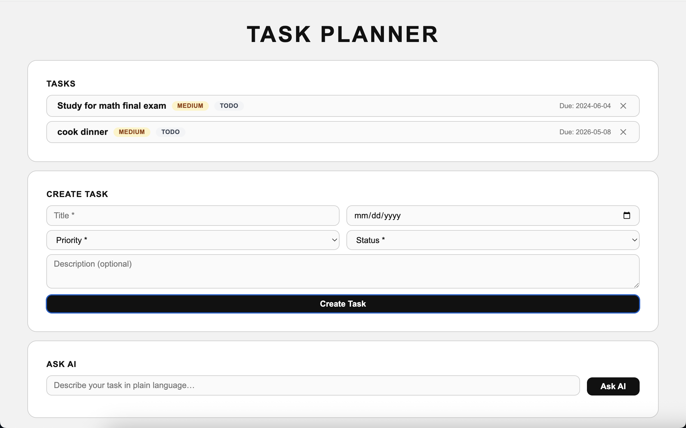
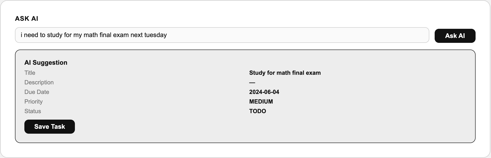
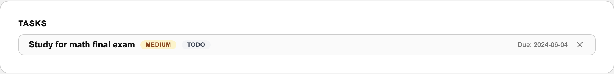

# Task Planner — Eulerity Assessment

A personal task manager REST API built with Spring Boot, backed by an H2 in-memory database, with an AI-powered task suggestion endpoint and a plain HTML/JS frontend.



## Tools Used

| Tool | Purpose |
|------|---------|
| **Spring Boot 3.4.5** | REST API framework, dependency injection, JPA integration |
| **H2 (in-memory)** | Embedded database — tasks do **not** persist between restarts |
| **Gemini API** (`gemini-2.5-flash`) | AI-powered task suggestion from plain-language prompts |
| **HTML / JavaScript** | Single-page frontend served as a static asset |
| **JUnit 5 + Mockito** | Unit tests (TaskService, AiTaskService), controller slice tests (@WebMvcTest), and one full integration test (@SpringBootTest) |

## Setup

**Prerequisites:** Java 17+, a [Google AI Studio](https://aistudio.google.com/) API key.

```bash
git clone https://github.com/dinoanna/eulerity-assessment.git
cd eulerity-assessment
```

## Running the App

```bash
GEMINI_API_KEY=your_api_key_here ./gradlew bootRun
```

Open [http://localhost:8080](http://localhost:8080) in your browser to use the UI.

> The H2 console is available at [http://localhost:8080/h2-console](http://localhost:8080/h2-console) (JDBC URL: `jdbc:h2:mem:taskmanager`).

## API Endpoints

| Method | Path | Description |
|---|---|---|
| `GET` | `/tasks` | List all tasks |
| `POST` | `/tasks` | Create a task |
| `GET` | `/tasks/{id}` | Get a task by ID |
| `PUT` | `/tasks/{id}` | Update a task |
| `DELETE` | `/tasks/{id}` | Delete a task |
| `POST` | `/tasks/suggest` | AI-powered task suggestion |

### Create / Update Task — Request Body

```json
{
  "title": "Write project report",
  "description": "Include results from Q1",
  "dueDate": "2026-06-01",
  "priority": "HIGH",
  "status": "TODO"
}
```

`title`, `dueDate`, `priority`, and `status` are required. `description` is optional.

`priority`: `LOW` | `MEDIUM` | `HIGH`  
`status`: `TODO` | `IN_PROGRESS` | `DONE`

### AI Suggestion Endpoint — `POST /tasks/suggest`

Describe a task in plain language and the endpoint returns a structured task object generated by Gemini.

**Request:**
```json
{ "prompt": "i need to study for my math final exam next tuesday" }
```

**Response:**
```json
{
  "title": "Study for math final exam",
  "description": null,
  "dueDate": "2024-06-04",
  "priority": "MEDIUM",
  "status": "TODO",
  "model": "gemini-2.5-flash",
  "rawContent": "{\"title\":\"Study for math final exam\", ...}"
}
```



The suggestion is not automatically saved — use `POST /tasks` with the returned fields to persist it (or click **Save Task** in the UI).

After saving, the task appears in the list:



**Error responses:**

| Status | Cause |
|---|---|
| `401 Unauthorized` | `GEMINI_API_KEY` is missing or invalid |
| `502 Bad Gateway` | Gemini returned an unexpected error |
| `504 Gateway Timeout` | Gemini did not respond within 15 seconds |

## Running Tests

```bash
./gradlew test
```
